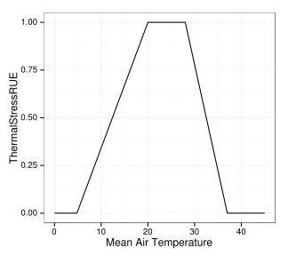

```{r header, message=FALSE, echo=FALSE}
library(ggplot2)
library(reshape2)
library(plyr)
```

# Documentation for the SUNFLO crop model

## Model structure
 
## Crop potential growth
### Phenology
### Leaf Area
### Light interception
### Biomass production
### Crop performance

## Environmental factors
### Thermal stress
```{r ThermalStressRUE, echo=FALSE}
# ThermalStressRUE
## Function
ThermalStressRUE.p <- c(4.8,20,28,37)
ThermalStressRUE <- function(tm, tb=4.8, tol=20, tou=28, tc=37) {
  ifelse(
    tm > tb & tm < tol, tm * (1/(tol - tb)) - (tb/(tol - tb)),
    ifelse(
      tm >= tol & tm <= tou, 1,
      ifelse(
        tm > tou & tm < tc, tm * (1/(tou - tc)) - (tc/(tou-tc)),
        ifelse(
          tm <= tb | tm >= tc, 0, NA
        )
      )
    )
  )
}

## Graph
s <- seq(0,45,by=0.2)
d <- data.frame(
  x = s,
  y = ThermalStressRUE(s)
)

p <- ggplot(d, aes(x,y)) + geom_line() + theme_bw() + labs(x="Mean Air Temperature", y="ThermalStressRUE")
ggsave(p, file="./figure/ThermalStressRUE.svg", height=4, width=4.5, units="in")
```

ThermalStressRUE | water stress impact on photosynthesis | 
-----|----------|
| $$
ThermalStressRUE = \left\{ 
  \begin{array}{ll}
  T_m \cdot \frac{1}{T_{ol} - T_b} - \frac{T_b}{T_{ol} - T_b} & \textrm{if $T_b < T_m < T_{ol}$} \\  
  1 & \textrm{if $T_{ol} < T_m < T_{ou}$} \\
  T_m \cdot \frac{1}{T_{ou} - tc} - \frac{tc}{T_{ou} - tc} & \textrm{if $T_{ou} < T_m < tc$} \\
  0 & \textrm{else}
	\end{array} \right.
$$ with $T_b = 4.8$, base temperature (°C); $T_{ol} = 20$, optimal lower temperature (°C); $T_{ou} = 28$, optimal upper temperature (°C); $T_c = 37$, critical temperature (°C)


### Water stress
$$WaterStressPheno = a(T_m-T_b)(1-WaterStressConductance)$$

### Nitrogen stress

### Radiation stress
