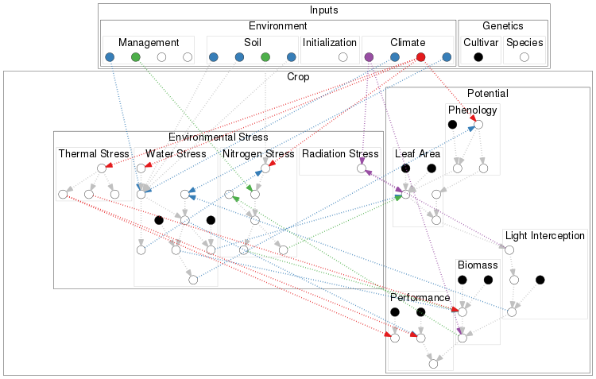
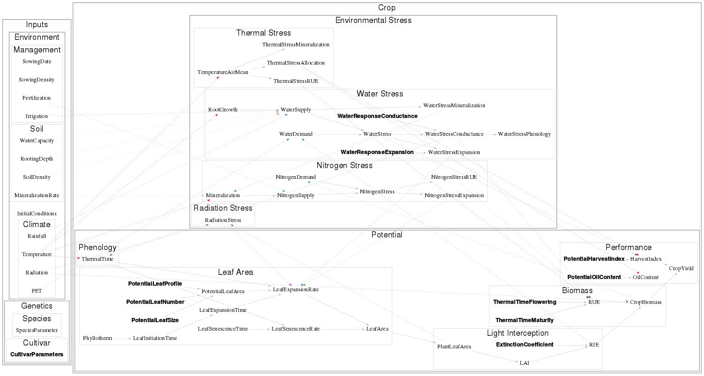

```{r header, message=FALSE, warning=FALSE ,echo=FALSE}
# TODO : manage to get consistent look between github markdown interpretation (sundown) and knitr html (rmarkdown)
# TODO : made small parameters table linked subsets of the complete parameter table

library(ggplot2)
library(reshape2)
library(dplyr)
library(pander)
library(XLConnect)

setwd("/home/casadebaig/Documents/Travail/2011_SUNFLO/dev/rsunflo/inst/doc/")

# data
db <- loadWorkbook(file="./files/parameterization.xlsx") 
sunflo <- list(
  climate = readWorksheet(db, sheet="climate"),
  parameters = readWorksheet(db, sheet="parameters"),
  outputs = readWorksheet(db, sheet="outputs")
)
sunflo$parameters <- mutate(sunflo$parameters, value=as.numeric(gsub(",",".",value)))

# options
fig_dpi = 100
```


# Model structure
```{r structure, echo=FALSE, eval=FALSE}
# Build model graph from R
graph_ext <- "png"
graph_nodes <- "-Nlabel= -Nshape=circle -Gdpi=150 -Earrowsize=2 -Epenwidth=4 -Estyle=dotted"

# Simple graph : replace nodes names by points
call <- paste0("dot -T ",graph_ext," -o ./files/structure_nodes.",graph_ext," ./files/structure_nodes.dot")
system(call)
# system(paste(call, graph_nodes))

# Complete graph
call <- paste0("dot -T ",graph_ext," -o ./files/structure.",graph_ext," ./files/structure.dot")
system(call)

```

## Modules
 

## Variables
 


# Inputs

## Environment

### Climate
```{r InputsClimate, echo=FALSE, results='asis'}
# data
s <- select(sunflo$climate, label=label.doc, description=label.en, unit)
# table
pandoc.table(s, style = "grid", split.tables="Inf", justify="left")
```

### Soil
```{r InputsSoil, echo=FALSE, results='asis'}
# data
s <- sunflo$parameters %.%
  filter(category=="Pedoclimat", template.default==1, name.vle!="datas_file") %.%
  select(label=label.doc, description=label.en, value, unit, reference)
# table
pandoc.table(s, style = "grid", split.tables="Inf", justify="left")
```

### Management
```{r InputsManagement, echo=FALSE, results='asis'}
# data
s <- sunflo$parameters %.%
  filter(category=="Conduite", template.default==1) %.%
  select(label=label.doc, description=label.en, value, unit, reference)
# table
pandoc.table(s, style = "grid", split.tables="Inf", justify="left")
```


## Genetics
### Species
### Cultivar
```{r InputsCultivar, echo=FALSE, results='asis'}
# data
s <- sunflo$parameters %.%
  filter(category=="Variete", template.default==1) %.%
  select(label=label.doc, description=label.en, value, unit, reference)
# table
pandoc.table(s, style = "grid", split.tables="Inf", justify="left")
```


# Crop potential growth

## Phenology
### Inputs
```{r InputsPhenology, echo=FALSE, results='asis'}
# data
s <- sunflo$parameters %.% 
  filter(module=="Phenology") %.%
  select(label=label.doc, description=label.en, value, unit, reference)

# table
pandoc.table(s, style = "grid", split.tables="Inf", justify="left")
```

### Emergence
$Emergence = Germination + ElongationRate \cdot SowingDepth$

with : 
$Germination = 86$, Thermal time for germination (°C.d) [@Casadebaig2011] ;
$ElongationRate = 1.19$, Hypocotyl elongation rate (°Cd/mm) [@Villalobos1996] ;
$SowingDepth = 30$, Sowing depth (mm).

### ThermalTime
$$
  ThermalTime_d=
	\left\{ 
	\begin{array}{ll}
	\int_0^d (T_m - T_b) \cdot (1 + WaterStressPhenology) \cdot dt & \textrm{if $T_m > T_b$} \\  
	0 & \textrm{else}
	\end{array} 
	\right.
$$

with : 
$T_m$, Daily mean air temperature (°C); 
$T_b = 4.8$, Basal temperature (°C) see [@Granier1998]; 
$ThermalStressPhenology$ Water stress effect on plant heating

### PhenoStages
```{r PhenoStages, echo=FALSE, fig.width=8, fig.height=2.5}
# Data
parameters <- c("ThermalTimeVegetative", "ThermalTimeFlowering",
                "ThermalTimeSenescence", "ThermalTimeMaturity",
                "Germination")

s <- sunflo$parameters %.%
  filter(module=="Phenology", label.doc %in% parameters) %.%
  select(label=label.doc, value)

# add emergence state
s <- rbind(s, data.frame(label="Emergence", value=0))
# change germination value according to emergence
s[s$label=="Germination",]$value <- -200+ s[s$label=="Germination",]$value
# compute start phase for plotting
s <- mutate(
  s,
  phase=c("Vegetative","Floral Initiation","Flowering","Grain Filling","Germination","Elongation"),
  start=c(0, 482, 836, 1083, -200, -200+86.2),
  end=value
)

s <- mutate(s, phase=factor(phase, levels=phase))

# plot
p <- ggplot(s) +
  geom_segment(aes(x=start, xend=end, y=0, yend=0, color=phase), size=5) +
  geom_text(aes(x=value, y=0, label=label), vjust=0.5, size=3, angle=90, hjust=-0.1) +
  theme_bw() + labs(x="ThermalTime", y="") + ylim(0,0.5) +
  scale_color_manual(values = terrain.colors(6)) +
  theme(axis.text.y=element_blank(), axis.ticks.y=element_blank())

print(p)
# ggsave(p, file="./figure/PhenoStage.png", height=2.5, width=8, units="in", dpi=fig_dpi)
```


## LeafArea
### Inputs
```{r InputsLeafArea, echo=FALSE, results='asis'}
# data
s <- sunflo$parameters %.% 
  filter(module=="LeafArea") %.%
  select(label=label.doc, description=label.en, value, unit, reference)

# table
pandoc.table(s, style = "grid", split.tables="Inf", justify="left")
```

### LeafInitiationTime, LeafExpansionTime, LeafSenescenceTime
```{r LeafExpansionTime, echo=FALSE, fig.width=4, fig.height=4}
# Function
LeafInitiationTime <- function(i, phy_1=71.43, phy_7=16.34, i_max=30, a=420){
  ifelse(
    i <= 6, i*phy_1,
      ifelse(
        i <= i_max,
        (i-5) * phy_7 + a, NA
      )
  )
}

LeafExpansionDuration <- function(i, TLN=30, LLH=17, y0=851.3, a=153, b=0.78){
  a + y0 * exp(-((i - LLH)^2) / ((b * TLN)^2))
}

# Data
s <- 1:30
d <- data.frame(
  x = s,
  Initiation = LeafInitiationTime(s)
)

d <- mutate(
  d,
  Expansion = Initiation + 1/0.01379,
  Senescence = Expansion + LeafExpansionDuration(s)
)

d <- melt(d, id.vars="x", value.name = "y", variable.name="Process")

# Graph
p <- ggplot(d, aes(x=y, y=x, color=Process)) + geom_path() +
  theme_bw() + labs(x="ThermalTime", y="Node") +
  theme(legend.direction = "horizontal", legend.position = "bottom")

print(p)
```

$$
  LeafInitiationTime_i = \left\{ 
  \begin{array}{ll}
	i \cdot Phyllotherm_1 & \textrm{if $i \leq 6$} \\  
	(i-5) \cdot Phyllotherm_7 + a & \textrm{if $i \leq LeafNumber$}
	\end{array} \right.
$$

with $Phyllotherm_1=76.43$ (°C.d), $Phyllotherm_7=16.34$ (°C.d) and $a=400$ (°C.d)

$$LeafExpansionTime_i=LeafInitiation_i + 1/a$$

with $a=0.01379$.

```{r LeafSenescenceTime, echo=FALSE, fig.width=4, fig.height=3.5}
# Data
s <- 1:30
d <- data.frame(
  x = s,
  y = LeafExpansionDuration(s)
)

# Graph
p <- ggplot(d, aes(x,y)) + geom_line() + theme_bw() + labs(x="Node", y="LeafExpansionDuration")
print(p)
```

$$LeafExpansionDuration_i = a + PotentialLeafDuration \cdot exp^{\frac{-(i-PotentialLeafProfile)^2}{(c \cdot PotentialLeafNumber)^2}}$$

with $PotentialLeafDuration=851.3$ (°C.d), $a=153$ (°C.d), $b=0.78$

$$LeafSenescenceTime_i = LeafExpansionTime_i + LeafExpansionDuration_i$$


### PotentialLeafArea
```{r PotentialLeafArea, echo=FALSE, fig.width=4, fig.height=3.5}
PotentialLeafArea <- function(i, LLS=448, LLH=17, a=-2.05, b=0.049) {
  LLS * exp(a*((i-LLH)/(LLH-1))^2 + b*((i-LLH)/(LLH-1))^3) 
}

# Data
s <- 1:30
d <- data.frame(
  x = s,
  y = PotentialLeafArea(s)
)

# Graph
p <- ggplot(d, aes(x,y)) + geom_line() + theme_bw() + labs(x="Node", y="PotentialLeafArea (cm2)")
print(p)

```

$$
PotentialLeafArea_i = PotentialLeafSize \cdot exp^{a \cdot (\frac{i-PotentialLeafProfile}{PotentialLeafProfile-1})^2 + b \cdot
(\frac{i-PotentialLeafProfile}{PotentialLeafProfile-1})^3}
$$

with $a=-2.05$ and $b=0.049$, shape parameters; $PotentialLeafSize$ (cm2) and $PotentialLeafProfile$ (node), genotypic parameters.

### LeafGrowthRate, LeafSenescenceRate, LeafArea
```{r LeafGrowthRate, echo=FALSE, fig.width=4, fig.height=4}
# Function
LeafGrowthRate <- function(t, te, Ae, Teff, Ke=0.01379){
  Teff * (Ae * Ke) * exp(-Ke * (t - te)) / (1 + exp(-Ke * (t - te)))^2
}

# Data
s <- 0:2000
d <- data.frame(
  x = s,
  Expansion = LeafGrowthRate(t=s, te=500, Ae=300, Teff=(25-4.8)),
  Senescence = LeafGrowthRate(t=s, te=1500, Ae=300, Teff=(25-4.8))
)
d <- melt(d, id.vars="x", value.name = "y", variable.name="Process")

# Graph
p <- ggplot(d, aes(x, y, color=Process)) + geom_path() +
  theme_bw() + labs(x="ThermalTime (°Cd)", y="GrowthRate (cm2/°Cd)") +
  theme(legend.direction = "horizontal", legend.position = "bottom")

print(p)

```

$$
LeafGrowthRate_i = (T_m - T_b) \cdot PotentialLeafArea_i \cdot a \cdot 
\frac{exp^{-a(ThermalTime-LeafExpansionTime_i)}}{(1+exp^{-a(ThermalTime-LeafExpansionTime_i)})^2}
$$

$$
LeafSenescenceRate_i = (T_m - T_b) \cdot LeafArea_i \cdot a \cdot 
\frac{exp^{-a(ThermalTime-LeafSenescenceTime_i)}}{(1+exp^{-a(ThermalTime-LeafSenescenceTime_i)})^2}
$$

with $T_m=25$, mean air temperature (°C); $T_b=4.8$, base temperature (°C); $a=0.01379$.  
The illustration uses $i=10$ as values for $PotentialLeafArea_i$, $LeafExpansionTime_i$ and $LeafSenescenceTime_i$

$$LeafArea_i=\int LeafGrowthRate_i - \int LeafSenescenceRate_i$$

## Light interception
### LAI
$$LAI = \sum_{i=1}^{LeafNumber} LeafArea_i$$

### RIE
$$RIE = 1 - exp^{(-ExtinctionCoefficient * LAI)}$$

## Biomass production
### RUE
```{r RUE, echo=FALSE, fig.width=4, fig.height=4}
# Function
PotentialRUE <- function(
  t,
  r0=1,
  rmax=3,
  ThermalTimeFlowering = 836,
  ThermalTimeSenescence = 1083,
  ThermalTimeMaturity = 1673,
  a = 0.015,
  b = 4.5
  ) {
  ifelse(
    t < 300, r0,
    ifelse(
      t >= 300 & t < ThermalTimeFlowering, r0 + 2*(t-300)/(ThermalTimeFlowering-300),
      ifelse(
        t >= ThermalTimeFlowering & t < ThermalTimeSenescence-100, rmax,
        ifelse(
          t >= ThermalTimeSenescence-100 & t <  ThermalTimeMaturity,
          a * exp(b*(1-((t-ThermalTimeSenescence)/(ThermalTimeMaturity-ThermalTimeSenescence)))), 0
        )
      )
    )
  )
}

# Graph
s <- 0:2000
d <- data.frame(
  x = s,
  y = PotentialRUE(s)
)

p <- ggplot(d, aes(x,y)) + geom_line() + theme_bw() + labs(x="Thermal Time (°C.d)", y="PotentialRUE")
print(p)

```

$$
PotentialRUE = \left\{ 
	\begin{array}{ll}
	r_0 & \textrm{if $ThermalTime < 300 $} \\  
	r_0 + 2 \cdot \frac{ThermalTime-300}{ThermalTimeFlowering-300} & \textrm{if $300 < ThermalTime < ThermalTimeFlowering$}\\
	r_{max} & \textrm{if $ThermalTimeFlowering < ThermalTime < ThermalTimeSenescence$}\\
	a \cdot exp^{b \cdot (1-\frac{ThermalTime - ThermalTimeMaturity}{ThermalTimeMaturity - ThermalTimeSenescence})} & \textrm{if $ThermalTimeSenescence < ThermalTime < ThermalTimeMaturity$}\\
  0 & \textrm{else}
	\end{array}
  \right.
$$

with $r_0=1$, vegetative RUE; $r_{max}=3$, maximum RUE; $a=0.015$, final RUE; $b=4.5$, slope of RUE decrease in grain filling stage.

### CropBiomass [@Monteith1977]
$$dCropBiomass = 0.48 \cdot Radiation \cdot RIE \cdot RUE \cdot dt$$

## Crop performance


# Environmental factors limiting crop production

## Thermal stress
### ThermalStressRUE [@Villalobos1996]
```{r ThermalStressRUE, echo=FALSE, fig.width=4, fig.height=3.5}
# Function
ThermalStressRUE <- function(tm, tb=4.8, tol=20, tou=28, tc=37) {
  ifelse(
    tm > tb & tm < tol, tm * (1/(tol - tb)) - (tb/(tol - tb)),
    ifelse(
      tm >= tol & tm <= tou, 1,
      ifelse(
        tm > tou & tm < tc, tm * (1/(tou - tc)) - (tc/(tou-tc)),
        ifelse(
          tm <= tb | tm >= tc, 0, NA
        )
      )
    )
  )
}

# Graph
s <- seq(0,45,by=0.2)
d <- data.frame(
  x = s,
  y = ThermalStressRUE(s)
)

p <- ggplot(d, aes(x,y)) + geom_line() + theme_bw() + labs(x="Mean Air Temperature (°C)", y="ThermalStressRUE")
print(p)
# ggsave(p, file="./figure/ThermalStressRUE.png", height=3.5, width=4, units="in", dpi=fig_dpi)
```


$$
ThermalStressRUE = \left\{ 
  \begin{array}{ll}
  T_m \cdot \frac{1}{T_{ol} - T_b} - \frac{T_b}{T_{ol} - T_b} & \textrm{if $T_b < T_m < T_{ol}$} \\  
  1 & \textrm{if $T_{ol} < T_m < T_{ou}$} \\
  T_m \cdot \frac{1}{T_{ou} - tc} - \frac{tc}{T_{ou} - tc} & \textrm{if $T_{ou} < T_m < tc$} \\
  0 & \textrm{else}
	\end{array}
  \right.
$$

with $T_b = 4.8$, base temperature (°C); $T_{ol} = 20$, optimal lower temperature (°C); $T_{ou} = 28$, optimal upper temperature (°C); $T_c = 37$, critical temperature (°C)


### ThermalStressMineralization [@Vale2007]
```{r ThermalStressMineralization, echo=FALSE, fig.width=4, fig.height=3.5}
# Function
ThermalStressMineralization <- function(tm, tb=15, tc=36) {
  tc/(1 + (tc - 1) * exp(-0.119 * (tm - tb)))
}

## Graph
s <- seq(0,45,by=0.2)
d <- data.frame(
  x = s,
  y = ThermalStressMineralization(s)
)

p <- ggplot(d, aes(x,y)) + geom_line() + theme_bw() + labs(x="Mean Air Temperature (°C)", y="ThermalStressMineralization")
print(p)
# ggsave(p, file="./figure/ThermalStressMineralization.png", height=3.5, width=4, units="in", dpi=fig_dpi)
```

$$ThermalStressMineralization = \frac{T_c}{1 + (T_c - 1) \cdot exp^{(-0.119 \cdot (T_m - T_b))}}$$

with $T_b = 15$, base temperature (°C); $T_c = 36$, critical temperature (°C)

### ThermalStressAllocation


## Water stress

### WaterStressExpansion, WaterStressConductance
```{r WaterStressProcess, echo=FALSE, fig.width=4, fig.height=4}
# Function
WaterStressProcess <- function(ftsw, a=-5) {
  -1 + 2/(1 + exp(a*ftsw))
}

## Graph
s <- seq(0,1, by=0.01)
d <- data.frame(
  x = s,
  Expansion = WaterStressProcess(s, a=-4.42),
  Conductance = WaterStressProcess(s, a=-9.3)
)
d <- melt(d, id.vars="x", value.name = "y", variable.name="Process")

p <- ggplot(d, aes(x, y, color=Process)) + geom_line() + theme_bw() +
  labs(x="WaterStress (FTSW)", y="WaterStressProcess") +
  theme(legend.direction = "horizontal", legend.position = "bottom")

print(p)
# ggsave(p, file="./figure/WaterStressProcess.png", height=4, width=4, units="in", dpi=fig_dpi)
```

$$ WaterStressProcess = -1 + \frac{2}{1 + exp^{(a \cdot WaterStress)}}$$ 

with $a \in [-15.6;-2.3]$, genotype-dependant response parameter


### WaterStressPhenology
$$WaterStressPhenology = a \cdot (1 - WaterStressConductance)$$
with $a=0.1$, scaling parameter for water-stress plant heating

### WaterStressMineralization
$$WaterStressMineralization = 1 - (1 - y_0) \cdot (1 - RelativeWaterContent_{layer1})$$


## Nitrogen stress

## Radiation stress
### RadiationStressExpansion [@Rey2003]

```{r RadiationStressExpansion, echo=FALSE, fig.width=4, fig.height=3.5}
# Function
RadiationStressExpansion <- function(nipar, s=2.5, a=-0.14, b=1.13, c=4.13, d=2.09) {
  s * (a + (b/(1 + exp((c - nipar)/d))))
}

## Graph
s <- seq(0,15,by=0.1)
d <- data.frame(
  x = s,
  y = RadiationStressExpansion(nipar=s)
)

p <- ggplot(d, aes(x,y)) + geom_line() + theme_bw() +
  labs(x="Intercepted Radiation per LAI (MJ)", y="RadiationStressExpansion")

print(p)
# ggsave(p, file="./figure/RadiationStressExpansion.png", height=3.5, width=4, units="in", dpi=fig_dpi)
```

$$RadiationStressExpansion = s \cdot a + \frac{b}{1 + exp^{(\frac{c - IPAR/LAI}{d})}}$$ 

with $s=2.5$, scaling parameter for density effect; $a=-0.14$; $b=1.13$; $c=4.13$; $d=2.09$

# References
