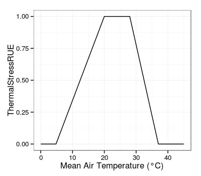
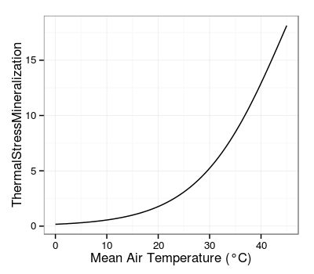
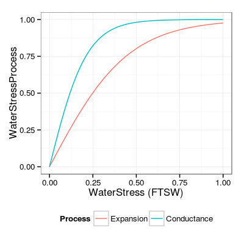
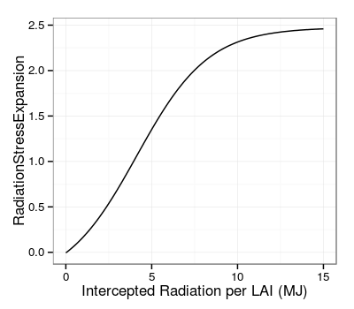

# Documentation for the SUNFLO crop model

## Model structure
 
## Crop potential growth
### Phenology
### Leaf Area
### Light interception
### Biomass production
### Crop performance

## Environmental factors
### Thermal stress
#### ThermalStressRUE [@Villalobos1996]

ThermalStressRUE | water stress impact on photosynthesis | 
-----|----------|
| $$
ThermalStressRUE = \left\{ 
  \begin{array}{ll}
  T_m \cdot \frac{1}{T_{ol} - T_b} - \frac{T_b}{T_{ol} - T_b} & \textrm{if $T_b < T_m < T_{ol}$} \\  
  1 & \textrm{if $T_{ol} < T_m < T_{ou}$} \\
  T_m \cdot \frac{1}{T_{ou} - tc} - \frac{tc}{T_{ou} - tc} & \textrm{if $T_{ou} < T_m < tc$} \\
  0 & \textrm{else}
	\end{array} \right.
$$ with $T_b = 4.8$, base temperature (°C); $T_{ol} = 20$, optimal lower temperature (°C); $T_{ou} = 28$, optimal upper temperature (°C); $T_c = 37$, critical temperature (°C)

#### ThermalStressMineralization [@Vale2007]

ThermalStressMineralization | water stress impact on nitrogen mineralization rate | 
-----|----------|
| $$
ThermalStressMineralization = \frac{T_c}{1 + (T_c - 1) \cdot exp^{(-0.119 \cdot (T_m - T_b))}}
$$ with $T_b = 15$, base temperature (°C); $T_c = 36$, critical temperature (°C)

#### ThermalStressAllocation

### Water stress

#### WaterStressExpansion, WaterStressConductance

WaterStressProcess | water stress impact on leaf expansion or transpiration rate | 
-----|----------|
| $$
WaterStressProcess = -1 + \frac{2}{1 + exp^{(a \cdot WaterStress)}}
$$ with $a \in [-15.6;-2.3]$, genotype-dependant response parameter

#### WaterStressPhenology
$$WaterStressPhenology = a \cdot (1 - WaterStressConductance)$$
with $a=0.1$, scaling parameter for water-stress plant heating

#### WaterStressMineralization
$$WaterStressMineralization = 1 - (1 - y_0) \cdot (1 - RelativeWaterContent_{layer1})$$

### Nitrogen stress

### Radiation stress
#### RadiationStressExpansion [@Ray2003]

RadiationStressExpansion | plant density impact on leaf expansion| 
-----|----------|
| $$
RadiationStressExpansion = s \cdot a + \frac{b}{1 + exp^{(\frac{c - IPAR/LAI}{d})}}
$$ with $s=2.5$, scaling parameter for density effect; $a=-0.14$; $b=1.13$; $c=4.13$; $d=2.09$

